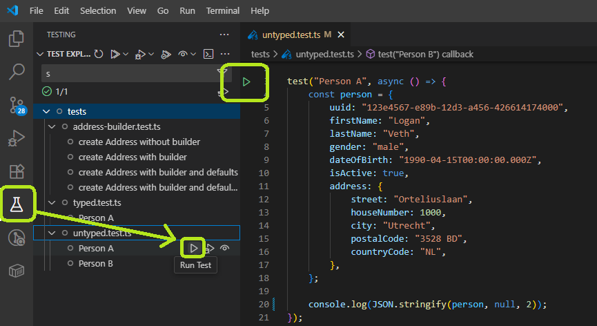

# Exercise 1: Understanding Type Safety - The Difference Between Flexible and Strict Code

Think of types like a blueprint for building a house. Without a blueprint, you might forget important things like doors or windows. With a blueprint, you're guaranteed to have everything you need in the right place.

In programming, **untyped** code is like building without a blueprint - you can put anything anywhere, but you might make mistakes. **Typed** code is like following a strict blueprint - the computer checks that you haven't forgotten anything important.

## Part 1: Untyped Code (No Blueprint)
Let's see what happens when we work without a "blueprint":

- Open [untyped.test.ts](../tests/untyped.test.ts)
- Run the test by clicking the ▶️ play button next to the test name
- Look at the `TEST RESULTS` in the bottom console to see the person object

**Now let's break things (safely):**
- Remove the `lastName` property from the person object (delete the entire line)
- Run the test again - notice it still works! The console shows the person without a last name
- Add any random property you want (like `favoriteColor: "purple"`)
- Run the test again - it still works!

**What did we learn?** Without types, you can add, remove, or change anything. This flexibility can be dangerous because mistakes won't be caught.

## Part 2: Typed Code (With Blueprint)
Now let's see what happens when we follow a strict "blueprint":

- Open [typed.test.ts](../tests/typed.test.ts)
- Run the test and check the console - notice the output looks similar
- Now remove the `lastName` property (delete the entire line)

**What happens?** You should see a red squiggly line appear! This is TypeScript telling you: "Hey, you're missing something important!"

- Hover your mouse over the red underlined `person` word on line 6
- You'll see an error message explaining what's wrong
- Now revert the `lastName` back and try adding an extra property (like `favoriteColor: "purple"`)

**What happens?** Another error! TypeScript is saying: "This property doesn't belong here according to the blueprint!"

## Understanding the Blueprint
The `:Person` part on line 6 is like showing your blueprint to the computer. You can click on [`Person`](../tests/models/person.ts) to see the actual blueprint

## Why This Matters for Testing
When writing tests, type safety helps you:
- ✅ Catch mistakes before running tests
- ✅ Ensure your test data matches real-world data structure
- ✅ Get helpful hints from your editor about what properties are available
- ✅ Prevent typos in property names
- ✅ Make sure you don't forget required information

Types are like having a helpful assistant that checks your work and prevents common mistakes!

### [Go back to Exercises](../README.md#exercises)