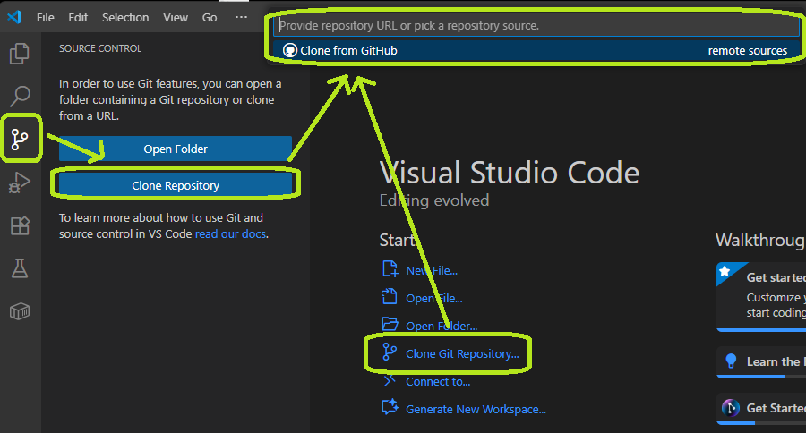
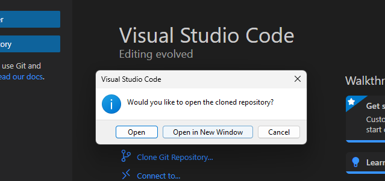
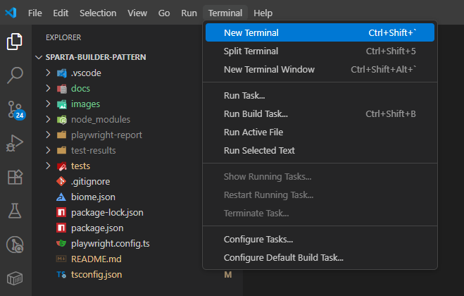

# Installation Guide

This guide will help you set up the Builder Pattern Workshop on your local machine.

## Prerequisites

### 1. Node.js
- **Required Version**: Node.js 18 or higher (latest LTS recommended)
- **Download**: [https://nodejs.org/](https://nodejs.org/)
- **Verify Installation**:
  ```bash
  node --version
  npm --version
  ```

### 2. Git
- **Download**: [https://git-scm.com/downloads](https://git-scm.com/downloads)
- **Verify Installation**:
  ```bash
  git --version
  ```

### 3. Visual Studio Code
- **Download**: [https://code.visualstudio.com/](https://code.visualstudio.com/)
- **Alternative**: Any IDE that supports TypeScript, but VS Code is recommended for this workshop

## Setup Instructions

### 1. Clone the Repository
- Open VS Code
- Click source control on the left (tree branch icon) or press (Ctrl+Shift+G)
- Click Clone Repository
- On the middle on top fill in the git repo and press Enter (https://github.com/CeriosTesting/sparta-builder-pattern)


- Choose where you want store this repo folder
- Click "Open"




### 2. Install Dependencies
- Open a new terminal inside VS Code



### Windows Users: Fix Execution Policy (If Needed)
If you're on Windows and get an execution policy error when running npm commands, you need to update PowerShell's execution policy:

**Error you might see:**
```
cannot be loaded because running scripts is disabled on this system
```

**Solution:**
1. **Open PowerShell as Administrator**:
   - Press `Windows + X`
   - Select "Windows PowerShell (Admin)" or "Terminal (Admin)"

2. **Run this command to allow script execution**:
   ```powershell
   Set-ExecutionPolicy -ExecutionPolicy RemoteSigned -Scope CurrentUser
   ```

3. **Type `Y` when prompted** to confirm the change

4. **Close the admin PowerShell** and return to VS Code terminal

**What this does:** Allows locally created scripts to run while still requiring downloaded scripts to be signed. This is a safe setting for development work.

**Alternative (if above doesn't work):**
```powershell
Set-ExecutionPolicy -ExecutionPolicy Unrestricted -Scope CurrentUser
```

- Execute the following command
```bash
npm install
```

### 3. Install Playwright
Playwright needs to download browser binaries:
- Execute the following command
```bash
npx playwright install
```

### 4. Install Recommended Extensions
When you open the project in VS Code, you should see a notification to install recommended extensions. Click "Install All" or install them manually:

- **Playwright Test for VSCode** (`ms-playwright.playwright`)
- **Pretty TypeScript Errors** (`YoavBls.pretty-ts-errors`)
- **Biome** (`biomejs.biome`)

You can also install them via the command palette:
1. Press `Ctrl+Shift+P` (or `Cmd+Shift+P` on Mac)
2. Type "Extensions: Show Recommended Extensions"
3. Install the recommended extensions

## Project Structure
After installation, your project structure should look like this:
```
sparta-builder-pattern/
├── docs/              # Workshop documentation
├── images/            # Workshop images
├── tests/             # Test files, models, builders and directors
│   ├── directors/     # Director classes
│   ├── builders/      # Builder classes
│   ├── enums/         # TypeScript enums
│   └── models/        # Data models
├── node_modules/      # Dependencies (created after npm install)
├── playwright-report/ # Test reports (created after running tests)
└── test-results/      # Test artifacts (created after running tests)
```

## Doing this installation for the workshop in the future?
Hold your horses! You first need an explanation about the workshop. Store your laptop safely...

## Is it workshop day?
Once everything is installed and verified, you're ready to begin the workshop! Start with [Exercise 1](EXERCISE1.md).

## Need Help?
Ask the trainer or make use of AI? =P